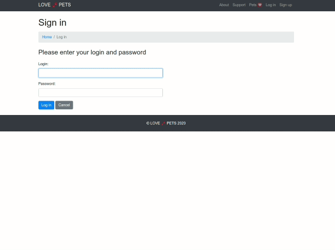

# Love-Pets

Application for finding a new home for pets. Everyone can see pets for adoption. Logged-in users have possibility to add a new pet and manage previously added. Admins are responsible for creating new pet types. Additionally they can manage all pets and all users. Project was created for practice Spring Boot and other technologies.

***
### Technologies
- Java
- Spring Boot, Spring Security, Spring Data JPA
- Thymeleaf
- PostgreSQL
- HTML, CSS, Bootstrap, JavaScript

---
### From application

---

***
### Resources
* Index page slider: 
    - Photo by <a href="https://www.pexels.com/@taryn-elliott">Taryn Elliott</a> from Pexels 
    - Photo by <a href="https://www.pexels.com/@minan1398">Min An</a> from Pexels
    - Photo by <a href="https://www.pexels.com/@snapwire">Snapwire</a> from Pexels
* Pets:
    - Molly -> <a href="https://pixabay.com/pl/users/safepaws-3559168/?utm_source=link-attribution&amp;utm_medium=referral&amp;utm_campaign=image&amp;utm_content=1752894"> safepaws</a> z <a href="https://pixabay.com/pl/?utm_source=link-attribution&amp;utm_medium=referral&amp;utm_campaign=image&amp;utm_content=1752894"> Pixabay</a>
    - Shadow -> <a href="https://pixabay.com/pl/users/kwiaatekk-14561648/?utm_source=link-attribution&amp;utm_medium=referral&amp;utm_campaign=image&amp;utm_content=4688579"> Patrycja Kwiatkowska</a> z <a href="https://pixabay.com/pl/?utm_source=link-attribution&amp;utm_medium=referral&amp;utm_campaign=image&amp;utm_content=4688579"> Pixabay</a>
    - Hunter -> <a href="https://pixabay.com/pl/users/nikiko-268709/?utm_source=link-attribution&amp;utm_medium=referral&amp;utm_campaign=image&amp;utm_content=354526"> Nicole Köhler</a> z <a href="https://pixabay.com/pl/?utm_source=link-attribution&amp;utm_medium=referral&amp;utm_campaign=image&amp;utm_content=354526"> Pixabay</a>